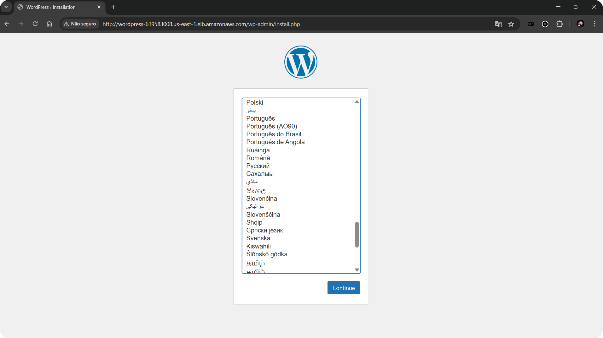

# 🐳 WordPress com Docker + AWS Infrastructure

<div align="center">
<h3>Implantação de alta disponibilidade utilizando containers e serviços gerenciados AWS</h3>
<p>Tempo estimado de configuração: 45-60 minutos</p>
</div>

## 📑 ÍNDICE
| Seção | Descrição |  
|-------|-----------|
| [🎯 Objetivos](#-objetivos) | Metas do projeto |  
| [📋 Requisitos Técnicos](#-requisitos-técnicos) | Especificações técnicas do projeto |
| [🏗️ Arquitetura Proposta](#-arquitetura-proposta) | Topologia e componentes da infraestrutura |
| [🛠️ Recursos Necessários](#-recursos-necessários) | Pré-requisitos e configurações |  
| [🌐 Configuração AWS](#-configurando-o-ambiente-aws) | VPC, Security Groups e EC2 |  
| [📦 Serviços de Armazenamento](#-criar-o-efs) | EFS e RDS |
| [⚖️ Balanceamento de Carga](#-criar-o-target-group-do-load-balancer) | Target Groups e Load Balancer |
| [🚀 Instalação do WordPress](#-criando-a-aplicação-do-wordpress) | Template EC2 e Auto Scaling |
| [✅ Testando a Aplicação](#-testando-a-aplicação) | Verificação e troubleshooting |
| [🤝 Contribuição](#-contribuição) | Como contribuir com o projeto |
| [📜 Licença](#-licença) | Licenciamento do projeto |

---

## 🎯 OBJETIVOS
Implantar uma aplicação WordPress altamente disponível na AWS, utilizando:
- Containers Docker
- Banco de dados gerenciado (RDS MySQL)
- Armazenamento de arquivos estáticos (EFS)
- Balanceamento de carga (Load Balancer)
- Monitoramento e notificações via CloudWatch e SNS 

[⬆️ Voltar ao índice](#-índice)

---

## 📋 REQUISITOS TÉCNICOS

1. **Instalação e configuração do Docker** em instâncias EC2.
2. **Deploy do WordPress** em containers:
   - Aplicação WordPress containerizada.
   - Banco de dados MySQL via Amazon RDS.
3. **Utilização do Amazon EFS**:
   - Para armazenar arquivos estáticos (wp-content/uploads, etc.).
4. **Configuração de Load Balancer AWS**:
   - Direcionar tráfego para instâncias EC2.
   - **Evitar exposição de IP público direto** nas instâncias WordPress.
5. **Provisionamento automático**:
   - Instalações e configurações via **user_data.sh** (script de inicialização da instância).
6. **Aplicação WordPress**:
   - Deve funcionar na porta **80 ou 8080**.
   - Acesso via Load Balancer.
7. **Versionamento via Git**:
   - Todo o projeto deve ser versionado em repositório Git.
8. **Documentação clara e detalhada**:
   - Explicação dos passos, decisões e arquitetura.

[⬆️ Voltar ao índice](#-índice)

---

## 🏗️ ARQUITETURA PROPOSTA


### Componentes
- **Compute**: AWS EC2 com Docker
- **Database**: Amazon RDS MySQL
- **Storage**: Amazon EFS
- **Network**: VPC, Subnets e Security Groups
- **Load Balancing**: AWS Application Load Balancer

[⬆️ Voltar ao índice](#-índice)

---

## 🛠️ RECURSOS NECESSÁRIOS

### ✔️ Conta AWS ativa ([Criar conta gratuita](https://aws.amazon.com/pt/free/))

> A [Amazon Web Services (AWS)](https://aws.amazon.com/pt/what-is-aws/) é a plataforma de nuvem mais adotada e mais abrangente do mundo, oferecendo mais de 200 serviços completos de datacenters em todo o mundo. Milhões de clientes, incluindo as startups que crescem mais rápido, as maiores empresas e os maiores órgãos governamentais, estão usando a AWS para reduzir custos, ganhar agilidade e inovar mais rapidamente.

### ✔️ AWS CLI instalado
> [Clique aqui](https://docs.aws.amazon.com/cli/latest/userguide/getting-started-install.html) para acessar a documentação oficial.

### ✔️ Terminal com acesso SSH (Linux/Mac/WSL)

### ✔️ Conhecimentos básicos em:
- AWS
- Docker
- Redes
- Linux

[⬆️ Voltar ao índice](#-índice)

---

## 🌐 CONFIGURANDO O AMBIENTE AWS

### Criar a VPC
Agora vamos criar uma VPC na AWS com 4 sub-redes (2 privadas e 2 públicas), com um internet gateway conectado à uma das sub-redes públicas.

1. **Acesse o console AWS** - Na barra de busca, selecione VPC.
   
   

2. **Inicie a criação** - Clique em *Create VPC*.
   
   

3. **Configure a VPC** - Aplique as seguintes configurações e clique em *Create VPC*.
   
   
   

4. **Verifique a criação** - O fluxo deve ser similar a este:
   
   

### Criando Security Groups
Para este projeto, nós teremos 04 Security Groups, um para cada serviço.

1. **Acesse EC2** - No dashboard, clique em EC2. Na seção à esquerda, selecione *Security Groups*.
   
   

2. **Inicie a criação** - Clique em *Create Security Group*.
   
   

3. **Configure o Security Group** - Escolha um nome, faça uma descrição e selecione a VPC.
   
   

Agora, para cada Security Group, aplique as regras de entrada e saída conforme abaixo:

#### Security Group do Load Balancer
Objetivo: Proteger o Load Balancer e permitir tráfego somente vindo da internet.

***Inbound***:
| Tipo | Protocolo | Porta | Origem | Descrição |
|-------|-----------|-------|--------|-----------| 
| HTTP  | TCP       | 80   | Anywhere - IPV4| Permitir todo tráfego vindo da internet |
| Custom TCP  | TCP       | 8080  | Anywhere - IPV4 | Permitir tráfego HTTP alternativo vindo da internet |

***Outbound***:
| Tipo | Protocolo | Porta | Destino | Descrição |
|-------|-----------|-------|---------|-----------|
| All traffic | All | All | Anywhere - IPv4 | Permitir todo tráfego de saída |


#### Security Group da EC2 (Instância WordPress)
Objetivo: Proteger a instância e permitir tráfego somente vindo do Load Balancer.

***Inbound***:
| Tipo | Protocolo | Porta | Origem | Descrição |
|-------|-----------|-------|--------|-----------| 
| HTTP  | TCP       | 80    | SG do Load Balancer | Permitir tráfego HTTP |
| Custom TCP  | TCP       | 8080  | SG do Load Balancer | Permitir tráfego HTTP alternativo |
| SSH   | TCP       | 22    | Seu IP | Permitir acesso SSH para administração |

***Outbound***:
| Tipo | Protocolo | Porta | Destino | Descrição |
|-------|-----------|-------|---------|-----------|
| All traffic | All | All | Anywhere - IPv4 | Permitir todo tráfego de saída |

#### Security Group do RDS (Banco de Dados MySQL)
Objetivo: Proteger o banco de dados e permitir tráfego somente vindo da instância EC2.

***Inbound***:
| Tipo | Protocolo | Porta | Origem | Descrição |
|-------|-----------|-------|--------|-----------| 
| MYSQL/Aurora  | TCP       | 3306   | SG da EC2 | Permitir tráfego MySQL |

***Outbound***:
| Tipo | Protocolo | Porta | Destino | Descrição |
|-------|-----------|-------|---------|-----------|
| All traffic | All | All | Anywhere - IPv4 | Permitir todo tráfego de saída |

#### Security Group do EFS (Armazenamento de Arquivos)
Objetivo: Proteger o EFS e permitir tráfego somente vindo da instância EC2.

***Inbound***:
| Tipo | Protocolo | Porta | Origem | Descrição |
|-------|-----------|-------|--------|-----------| 
| NFS  | TCP       | 2049  | SG da EC2 | Permitir tráfego no EFS |

***Outbound***:
| Tipo | Protocolo | Porta | Destino | Descrição |
|-------|-----------|-------|---------|-----------|
| All traffic | All | All | Anywhere - IPv4 | Permitir todo tráfego de saída |

4. **Verifique os Security Groups** - Após a criação, seu dashboard deve estar similar a:

   

[⬆️ Voltar ao índice](#-índice)

---

## 📦 CRIAR O EFS

1. **Acesse o serviço EFS** - Na barra de pesquisa, digite EFS e clique na primeira opção. Em seguida, clique em *Create file system*.
   
   
   

2. **Configure o EFS** - Escolha um nome, selecione a *VPC* e clique em *Customize*.
   
   

3. **Aplique as configurações** - Configure conforme as imagens abaixo e clique em *Next*.
   
   > *As configurações que não estão indicadas ou alteradas permanecem como padrão*
   
   
   
   
   

4. **Finalize a criação** - Na última tela, revise as configurações e clique em *Create*.

## CRIAR O RDS

1. **Acesse o serviço RDS** - Na barra de pesquisa, digite RDS e clique na primeira opção. Em seguida, clique em *Create database*.
   
   
   

2. **Configure o banco de dados** - Aplique as configurações conforme as imagens abaixo, clicando em *Next* em cada etapa.
   
   > *As configurações que não estão indicadas ou alteradas permanecem como padrão*
   
   
   
   
   
   
   
   
   

3. **Finalize a criação** - Revise os dados e clique em *Create database*.

4. **Obtenha o endpoint** - Após a criação, clique em *View database* e copie o *endpoint* do banco de dados para uso posterior.
   
   

[⬆️ Voltar ao índice](#-índice)

---

## ⚖️ CRIAR O TARGET GROUP DO LOAD BALANCER

1. **Acesse Target Groups** - Na barra de pesquisa, digite *Target Groups* e clique em *"Target Groups - EC2 Feature"*. Em seguida, clique em *Create target group*.
   
   
   

2. **Configure o Target Group** - Aplique as configurações conforme as imagens abaixo e clique em *Next*.
   
   > *As configurações que não estão indicadas ou alteradas permanecem como padrão*
   
   
   
   
   
   > Para este projeto, o path do health check será `/readme.html`, página padrão criada automaticamente ao instalarmos o WordPress.

3. **Finalize a criação** - Não adicione instâncias neste momento e clique em *Create target group*.
   
   

4. **Edite atributos do Target Group** - Clique no target group criado e depois em *Edit*.
   
   

5. **Ajuste as configurações** - Aplique as configurações conforme a imagem abaixo e clique em *Save changes*.
   
   

## CRIAR O LOAD BALANCER

1. **Acesse Load Balancers** - Na barra de pesquisa, digite *Load Balancers* e clique em *"Load Balancers - EC2 Feature"*. Em seguida, clique em *Create Load Balancer*.
   
   
   

2. **Escolha o tipo** - Selecione *Application Load Balancer* e clique em *Create*.
   
   

3. **Configure o Load Balancer** - Aplique as configurações conforme as imagens abaixo e clique em *Next*.
   
   > *As configurações que não estão indicadas ou alteradas permanecem como padrão*
   
   
   
   
   

[⬆️ Voltar ao índice](#-índice)

---

## 🚀 CRIANDO A APLICAÇÃO DO WORDPRESS

### CRIAR UM TEMPLATE DA EC2

1. **Acesse Launch Templates** - Na barra de pesquisa, digite *Launch Templates* e clique na primeira opção. Em seguida, clique em *Launch instance*.
   
   
   

2. **Configure o template** - Aplique as configurações conforme as imagens abaixo e clique em *Next*.
   
   > *As configurações que não estão indicadas ou alteradas permanecem como padrão*
   
   
   

   > **Configurando a chave de acesso**
   > 
   > Se precisar criar a chave, clique em *Create new key pair* e siga as instruções.
   > 
   > 
   >
   > Após a criação, a chave será baixada automaticamente para sua máquina. É importante mantê-la disponível no momento da conexão com a instância. Se estiver usando o Windows com WSL, utilize o comando abaixo para copiar para a máquina Linux. Se já estiver utilizando Linux, pule esta etapa.
   > ```cmd
   > scp \caminho_para_chave\[SUA_CHAVE].pem [USUÁRIO]@[IP_LINUX]:/home/[USUÁRIO]
   > ```
   >
   > Já no Linux, aplique as permissões para a chave:
   > ```bash
   > chmod 400 [SUA_CHAVE].pem
   > ```

   
   

3. **Configure o User Data** - Na seção *Advanced details*, cole o script abaixo no campo *User data* e clique em *Create launch template*.
   
   > Este script irá instalar o WordPress e configurar o Docker na instância. Ele será executado automaticamente quando a instância for criada.

```bash
#!/bin/bash
set -e
trap 'echo "Erro na linha $LINENO. Comando: $BASH_COMMAND" >> /var/log/user-data-error.log' ERR

# VARIÁVEIS DE AMBIENTE
export DB_HOST="[ENDPOINT DO RDS]"
export DB_USER="[USUÁRIO MASTER CRIADO NO RDS]"
export DB_PASSWORD="[SENHA CRIADA NO RDS]"
export DB_NAME="[NOME ESCOLHIDO PARA O PRIMEIRO DATABASE]"
export DB_ROOT_PASSWORD="[ESCOLHA UMA SENHA ROOT]"

# DOCKER
apt-get update -y
apt-get install -y \
    ca-certificates \
    curl \
    gnupg \
    lsb-release \
    nfs-common

mkdir -p /etc/apt/keyrings
curl -fsSL https://download.docker.com/linux/$(. /etc/os-release && echo "$ID")/gpg | gpg --dearmor -o /etc/apt/keyrings/docker.gpg

echo \
  "deb [arch=$(dpkg --print-architecture) signed-by=/etc/apt/keyrings/docker.gpg] https://download.docker.com/linux/$(. /etc/os-release && echo "$ID") \
  $(lsb_release -cs) stable" | tee /etc/apt/sources.list.d/docker.list > /dev/null

apt-get update -y
apt-get install -y docker-ce docker-ce-cli containerd.io docker-buildx-plugin docker-compose-plugin

systemctl start docker
systemctl enable docker

usermod -aG docker ubuntu

# EFS
mkdir -p /mnt/wordpress
if mountpoint -q /mnt/wordpress; then
    echo "EFS já montado"
else
    mount -t nfs4 -o nfsvers=4.1,rsize=1048576,wsize=1048576,hard,timeo=600,retrans=2,noresvport [ENDPOINT DO EFS]:/ /mnt/wordpress
fi

mkdir -p /mnt/wordpress/wp-content

# DOCKER COMPOSE
cat > /home/ubuntu/compose.yml <<'EOF'
services:
  wordpress:
    image: wordpress:latest
    restart: always
    ports:
      - 80:80
    environment:
      WORDPRESS_DB_HOST: ${DB_HOST}
      WORDPRESS_DB_USER: ${DB_USER}
      WORDPRESS_DB_PASSWORD: ${DB_PASSWORD}
      WORDPRESS_DB_NAME: ${DB_NAME}
    volumes:
      - /mnt/wordpress/wp-content:/var/www/html/wp-content
      - /mnt/wordpress/wp-config:/var/www/html/wp-config
    network_mode: host
    
networks:
  wordpress:
    driver: bridge
EOF

# SUBIR O COMPOSE
cd /home/ubuntu
docker compose up -d

echo "Instalação concluída em $(date)" >> /var/log/user-data-complete.log
```

> **ATENÇÃO**: Não esqueça de substituir os valores entre colchetes `[]` pelas informações corretas.


### CRIAR O AUTO SCALING

1. **Acesse Auto Scaling Groups** - Na barra de pesquisa, digite *Auto Scaling Groups* e clique na primeira opção. Em seguida, clique em *Create Auto Scaling group*.
   
   
   

2. **Configure o Auto Scaling Group** - Aplique as configurações conforme as imagens abaixo e clique em *Next*.
   
   > *As configurações que não estão indicadas ou alteradas permanecem como padrão*
   
   
   
   
   
   
   
   
   
   
   > Escolha a *Scaling Policy* de acordo com seu projeto. Para este projeto, escolhemos a *Target tracking scaling policy*, utilizando o *metric type* **Average CPU utilization**, que irá aumentar ou diminuir a quantidade de instâncias de acordo com a utilização média da CPU.

3. **Finalize a criação** - Após finalizar, clique em *Create Auto Scaling group*. Se tudo estiver correto, seu dashboard de instâncias deve estar assim:
   
   

[⬆️ Voltar ao índice](#-índice)

---

## ✅ TESTANDO A APLICAÇÃO

1. **Acesse o Load Balancer** - Após alguns minutos, seu Load Balancer deve estar ativo. Busque na barra de pesquisa por Load Balancer e clique na opção.

2. **Obtenha o DNS do Load Balancer** - Selecione o Load Balancer criado e copie o *DNS name*.

3. **Acesse o WordPress** - Cole o DNS no navegador e verifique se a página do WordPress está carregando. Caso não esteja, aguarde alguns minutos e tente novamente.

4. **Configure o WordPress** - Se tudo estiver correto, você verá a tela de instalação do WordPress. Siga as instruções para finalizar a instalação.
   
   
   

5. **Faça login** - Após a instalação, você verá a tela de boas-vindas do WordPress. Clique em *Log in* para acessar o painel administrativo.
   
   

6. **Acesse o dashboard** - Após logar, você verá o painel administrativo do WordPress. Aqui, você pode gerenciar seu site, adicionar plugins, temas e muito mais.
   
   

### TESTANDO A PERSISTÊNCIA DOS ARQUIVOS

1. **Faça upload de uma imagem** - Acesse o painel administrativo do WordPress e vá em *Mídia* > *Biblioteca*. Faça o upload de uma imagem qualquer.
   
   

2. **Verifique o EFS** - Após o upload, acesse o EFS e verifique se a imagem foi salva na pasta `/mnt/wordpress/wp-content/uploads`.

3. **Teste a persistência** - Delete as instâncias EC2 e aguarde alguns minutos até que novas instâncias sejam criadas pelo Auto Scaling Group.

4. **Verifique a persistência** - Acesse o painel administrativo do WordPress novamente (através do DNS do Load Balancer) e vá em *Mídia* > *Biblioteca*. Verifique se a imagem ainda está disponível.
   
   

5. **Confirme o sucesso** - Se tudo estiver correto, você verá a imagem que fez o upload anteriormente.

### Problemas Comuns

| Problema | Possível Causa | Solução |
|----------|----------------|---------|
| WordPress não inicia | Problema na montagem do EFS | Verificar `df -h` e logs do Docker |
| Erro de conexão no banco | Credenciais incorretas ou Security Groups | Verificar variáveis de ambiente e regras de SG |
| Load Balancer marca instâncias como unhealthy | Aplicação não responde na porta 80 | Verificar status do Docker e firewall |
| Arquivos não persistem | EFS não montado corretamente | Verificar status da montagem e permissões |

[⬆️ Voltar ao índice](#-índice)

---

## 📜 Licença

Este projeto está licenciado sob a licença MIT - consulte o arquivo [LICENSE](LICENSE) para obter detalhes.

[⬆️ Voltar ao índice](#-índice)

---

## 🤝 Contribuição

1. Faça um fork do projeto
2. Crie sua branch (`git checkout -b feature/nova-feature`)
3. Commit suas mudanças (`git commit -m 'Adicionar nova feature'`)
4. Push para a branch (`git push origin feature/nova-feature`)
5. Abra um Pull Request

---

Desenvolvido por [Seu Nome] - [Seu Email/Contato]

[⬆️ Voltar ao índice](#-índice)