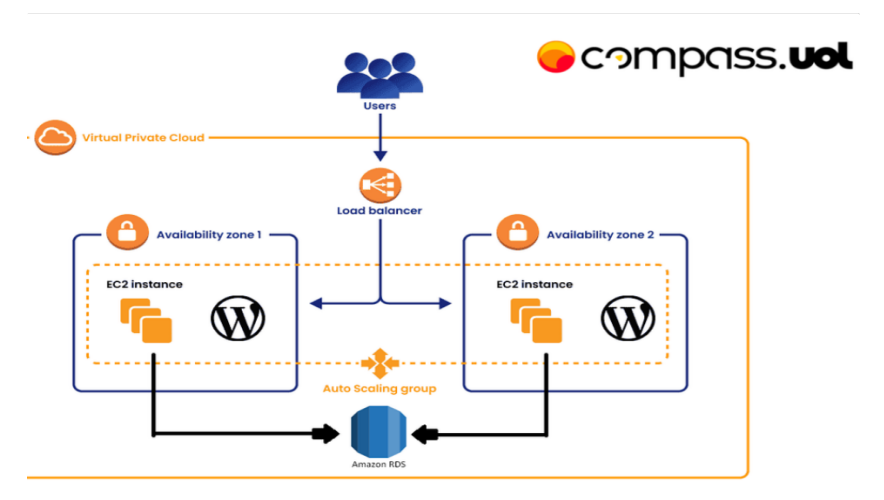
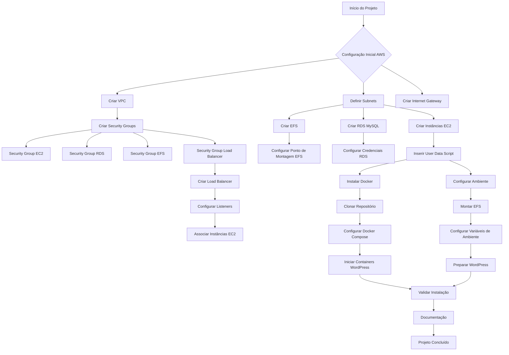

# 🐳 WordPress com Docker + AWS Infrastructure

# **MONITORANDO UM SERVIDOR WEB: GUIA PRÁTICO** 
*Um passo a passo visual para criação e automação de infraestrutura na AWS com notificações inteligentes.*

<br>

## ÍNDICE
| Seção | Descrição |  
|-------|-----------|
| [🎯 Objetivos](#objetivos) | Metas do projeto |  
| [🛠 Recursos Necessários](#recursos-necessários) | Pré-requisitos e configurações |  
| [🌐 Configuração AWS](#configurando-o-ambiente-aws) | VPC, Security Groups e EC2 |  
| [🔌 Conexão com a Instância](#conectando-se-à-instância) | Acesso SSH passo a passo |  
| [⚙️ Servidor Web](#configuração-do-servidor-web) | Instalação do Nginx e testes |  
| [🚨 Monitoramento](#monitoramento-e-notificações) | Scripts + Notificações no Telegram |  
| [🤖 Automação](#automação-com-user-data) | User Data para deploy rápido |  
| [📚 Recursos Úteis](#recursos-úteis) | Scripts prontos e comandos-chave |
| [✅ Conclusão](#conclusão) | Aprendizados e considerações finais |

---

<br>

## OBJETIVOS
Implantar uma aplicação WordPress altamente disponível na AWS, utilizando:
- Containers Docker
- Banco de dados gerenciado (RDS MySQL)
- Armazenamento de arquivos estáticos (EFS)
- Balanceamento de carga (Load Balancer)
- Monitoramento e notificações via CloudWatch e SNS 

<br>

[Voltar ao índice ⬆️](#índice)

---

<br>

## ARQUETETURA PROPOSTA


### Componentes
- **Compute**: AWS EC2 com Docker
- **Database**: Amazon RDS MySQL
- **Storage**: Amazon EFS
- **Network**: VPC, Subnets e Security Groups
- **Load Balancing**: AWS Application Load Balancer

<br>

[Voltar ao índice ⬆️](#índice)

---

<br>

## RECURSOS NECESSÁRIOS

✔️ Conta AWS ativa ([Criar conta gratuita](https://aws.amazon.com/pt/free/))

> A [Amazon Web Services (AWS)](https://aws.amazon.com/pt/what-is-aws/) é a plataforma de nuvem mais adotada e mais abrangente do mundo, oferecendo mais de 200 serviços completos de datacenters em todo o mundo. Milhões de clientes, incluindo as startups que crescem mais rápido, as maiores empresas e os maiores órgãos governamentais, estão usando a AWS para reduzir custos, ganhar agilidade e inovar mais rapidamente.

<br>

✔️ AWS CLI instalado
> [Clique aqui](https://docs.aws.amazon.com/cli/latest/userguide/getting-started-install.html) para acessar a documentação oficial.

<br>

✔️ Terminal com acesso SSH (Linux/Mac/WSL)

<br>

✔️ Conhecimentos básicos em:
  - AWS
  - Docker
  - Redes
  - Linux

<br>

[Voltar ao índice ⬆️](#índice)

---

<br>

# **CONFIGURANDO O AMBIENTE AWS**

## **Criar a VPC**
Agora vamos criar uma VPC na AWS com 4 sub-redes (2 privadas e 2 públicas), com um internet gateway conectado à uma das sub-redes públicas.

- Após logar no console AWS, selecione VPC (ou digite na barra de busca).<br>


- Clique em *Create VPC*<br>


- Aplique as configurações abaixo e clique em *Create VPC*<br>
<br>


- Se as configurações estiverem corretas, o fluxo ser similar à esse:<br>


<br>

## **Criando um Security Group**
- No dashboard, clique em EC2. Depois, na seção à esquerda, selecione *Secuity Group*<br>


- Clique em *Create Security Group*<br>


- Aplique as configurações abaixo e clique em *Create Security Group*<br>
<br>


<br>

## **Criar a instância EC2**
- Em EC2, na seção à esquerda, clique em *Instances* e depois em "Launch Instances"<br>
<br>


- Aplique as configurações abaixo:<br>
<br>


- Para criar um "Key Pair", faça:<br>


<br>

Após a criação, a chave será baixada automaticamente para sua máquina. É importante mantê-la disponível no momento da conexão com a instância. Se estiver usando o windows, com wsl, utilize o comando abaixo para copiar para a máquina Linux. Se já estiver utilizando Linux, pule esta etapa.
```cmd
scp \caminho_para_chave\[SUA_CHAVE].pem [USUÁRIO]@[IP_LINUX]:/home/[USUÁRIO]
```

<br>

- Já no linux, aplique as permissões para a chave:
```bash
chmod 400 [SUA_CHAVE].pem
```

<br>

- Continue as configurações:<br>
<br>


- Revise as configurações e clique em *Launch Instance* <br>


<br>

[🔙](#índice)

---

<br>

# **CONECTANDO-SE À INSTÂNCIA**
Agora é o momento de testar se todas as configurações foram aplicadas corretamente.

- No console AWS, ao selecionar sua instância, todas as informações sobre ela são exibidas <br>


- Verififique se o status da instância aparece como ***running*** <br>
.png)

<br>

- Agora, no seu terminal linux, utilize o comando abaixo:
```bash
ssh -i /local/da/chave/privada/[SUA_CHAVE].pem [USUÁRIO_EC2]@ip_publico
```

> Você também pode acessa esse comando pelo console AWS, clicando em ***connect*** e depois em ***SSH Client*** <br>
>  <br>
> 

- Será solicitado a confirmação de acesso. Digite `yes` e aperte enter. Se tudo ocorrer como esperado, você estará conectado à instância EC2

<br>

[🔙](#índice)

---

## 📋 Índice

- [🐳 WordPress com Docker + AWS Infrastructure](#-wordpress-com-docker--aws-infrastructure)
- [**MONITORANDO UM SERVIDOR WEB: GUIA PRÁTICO**](#monitorando-um-servidor-web-guia-prático)
  - [ÍNDICE](#índice)
  - [OBJETIVOS](#objetivos)
  - [ARQUETETURA PROPOSTA](#arquetetura-proposta)
    - [Componentes](#componentes)
  - [RECURSOS NECESSÁRIOS](#recursos-necessários)
- [**CONFIGURANDO O AMBIENTE AWS**](#configurando-o-ambiente-aws)
  - [**Criar a VPC**](#criar-a-vpc)
  - [**Criando um Security Group**](#criando-um-security-group)
  - [**Criar a instância EC2**](#criar-a-instância-ec2)
- [**CONECTANDO-SE À INSTÂNCIA**](#conectando-se-à-instância)
  - [📋 Índice](#-índice)
  - [🌐 Infraestrutura AWS](#-infraestrutura-aws)
    - [1. VPC e Rede](#1-vpc-e-rede)
      - [Configurações](#configurações)
    - [2. Security Groups](#2-security-groups)
      - [EC2 WordPress (SG-WordPress)](#ec2-wordpress-sg-wordpress)
      - [RDS MySQL (SG-RDS)](#rds-mysql-sg-rds)
      - [EFS (SG-EFS)](#efs-sg-efs)
      - [Load Balancer (SG-LB)](#load-balancer-sg-lb)
    - [3. EFS (Elastic File System)](#3-efs-elastic-file-system)
    - [4. RDS MySQL](#4-rds-mysql)
    - [5. EC2 + User Data](#5-ec2--user-data)
    - [6. Load Balancer](#6-load-balancer)
  - [Fluxo de Implantação](#fluxo-de-implantação)
  - [Configuração Docker](#configuração-docker)
    - [Docker Compose Explicado](#docker-compose-explicado)
  - [🔒 Segurança](#-segurança)
    - [Boas Práticas Implementadas](#boas-práticas-implementadas)
    - [Recomendações Adicionais](#recomendações-adicionais)
  - [🛠️ Troubleshooting](#️-troubleshooting)
    - [Verificação de Instalação](#verificação-de-instalação)
    - [Problemas Comuns](#problemas-comuns)
  - [📜 Licença](#-licença)
  - [🤝 Contribuição](#-contribuição)

## 🌐 Infraestrutura AWS

### 1. VPC e Rede

#### Configurações
1. **Criar VPC**:
   - Nome: `wordpress-vpc`
   - CIDR: `10.0.0.0/16`
   - Habilitar DNS hostnames e support

2. **Criar Subnets**:
   - **Públicas**: `10.0.1.0/24` e `10.0.2.0/24` (diferentes AZs)
   - **Privadas**: `10.0.3.0/24` e `10.0.4.0/24` (diferentes AZs)

3. **Internet Gateway**:
   - Nome: `wordpress-igw`
   - Anexar à VPC

4. **NAT Gateway**:
   - Criar NAT Gateway: `wordpress-nat`
   - Associar à subnet pública

5. **Tabelas de Rota**:
   - **Público**: Rota default para Internet Gateway
   - **Privado**: Rota default para NAT Gateway

### 2. Security Groups

#### EC2 WordPress (SG-WordPress)
Inbound:
| Tipo | Protocolo | Porta | Origem | Descrição |
|-------|-----------|-------|--------|-----------| 
| HTTP  | TCP       | 80    | SG do Load Balancer | Permitir tráfego HTTP |
| Custom TCP  | TCP       | 8080  | SG do Load Balancer | Permitir tráfego HTTP alternativo |
| SSH   | TCP       | 22    | Seu IP | Permitir acesso SSH para administração |

Outbound:
| Tipo | Protocolo | Porta | Destino | Descrição |
|-------|-----------|-------|---------|-----------|
| All traffic | All | All | Anywhere - IPv4 | Permitir todo tráfego de saída |

#### RDS MySQL (SG-RDS)
Inbound:
| Tipo | Protocolo | Porta | Origem | Descrição |
|-------|-----------|-------|--------|-----------| 
| MYSQL/Aurora  | TCP       | 3306   | SG-WordPress | Permitir tráfego MySQL |

Outbound:
| Tipo | Protocolo | Porta | Destino | Descrição |
|-------|-----------|-------|---------|-----------|
| All traffic | All | All | Anywhere - IPv4 | Permitir todo tráfego de saída |

#### EFS (SG-EFS)
Inbound:
| Tipo | Protocolo | Porta | Origem | Descrição |
|-------|-----------|-------|--------|-----------| 
| NFS  | TCP       | 2049  | SG-WordPress | Permitir tráfego no EFS |

Outbound:
| Tipo | Protocolo | Porta | Destino | Descrição |
|-------|-----------|-------|---------|-----------|
| All traffic | All | All | Anywhere - IPv4 | Permitir todo tráfego de saída |

#### Load Balancer (SG-LB)
Inbound:
| Tipo | Protocolo | Porta | Origem | Descrição |
|-------|-----------|-------|--------|-----------| 
| HTTP  | TCP       | 80   | Anywhere - IPV4| Permitir todo tráfego vindo da internet |
| Custom TCP  | TCP       | 8080  | Anywhere - IPV4 | Permitir tráfego HTTP alternativo vindo da internet |

Outbound:
| Tipo | Protocolo | Porta | Destino | Descrição |
|-------|-----------|-------|---------|-----------|
| All traffic | All | All | Anywhere - IPv4 | Permitir todo tráfego de saída |

### 3. EFS (Elastic File System)

1. **Criar EFS**:
   - Nome: `wordpress-efs`
   - VPC: `wordpress-vpc`
   - Criptografia: Habilitada
   - Performance: General Purpose

2. **Configurar Targets**:
   - Selecionar subnets privadas
   - Selecionar security group: `SG-EFS`

### 4. RDS MySQL

1. **Criar RDS**:
   - Engine: MySQL
   - Version: 8.0.x
   - Template: Production
   - DB Instance Identifier: `wordpress-db`
   - Credenciais:
     - Master Username: `wpuser` (ou nome escolhido)
     - Password: [Senha Segura]
   - Instance Configuration:
     - Tipo: `db.t3.small` (ou conforme necessidade)
     - Storage: Configurar tamanho e autoscaling

2. **Network & Security**:
   - VPC: `wordpress-vpc`
   - Subnet group: Criar novo com subnets privadas
   - Public access: No
   - Security Group: SG-RDS
   - Backup: Habilitar
   - Monitoring: Habilitar Enhanced Monitoring

### 5. EC2 + User Data

1. **Criar EC2**:
   - AMI: Amazon Linux 2
   - Tipo: t3.micro ou superior
   - Network: `wordpress-vpc`, subnet privada
   - Auto-assign IP: Disable
   - Security Group: `SG-WordPress`
   - IAM Role: Criar com permissões para EFS, CloudWatch
   - EBS: 8GB GP3

2. **User Data**:
```bash
#!/bin/bash
# User Data Script para Configuração Automática do WordPress com Docker

# Atualização do Sistema
yum update -y
yum upgrade -y

# Instalação de Dependências
yum install -y docker git amazon-efs-utils nfs-utils jq

# Iniciar e Habilitar Docker
systemctl start docker
systemctl enable docker

# Instalar Docker Compose
curl -L "https://github.com/docker/compose/releases/latest/download/docker-compose-$(uname -s)-$(uname -m)" -o /usr/local/bin/docker-compose
chmod +x /usr/local/bin/docker-compose

# Adicionar ec2-user ao grupo docker
usermod -aG docker ec2-user

# Criar diretório para WordPress
mkdir -p /opt/wordpress
cd /opt/wordpress

# Criar diretório para montagem do EFS
mkdir -p /mnt/efs/wordpress

# Montar EFS
mount -t nfs4 -o nfsvers=4.1,rsize=1048576,wsize=1048576,hard,timeo=600,retrans=2 fs-XXXXXX.efs.us-east-1.amazonaws.com:/ /mnt/efs
# Substitua fs-XXXXXX pelo ID do seu EFS e a região conforme necessário

# Configurar montagem automática na inicialização
echo "fs-XXXXXX.efs.us-east-1.amazonaws.com:/ /mnt/efs nfs4 nfsvers=4.1,rsize=1048576,wsize=1048576,hard,timeo=600,retrans=2 0 0" >> /etc/fstab

# Criar docker-compose.yml
cat > /opt/wordpress/docker-compose.yml << 'EOL'
version: '3'

services:
  wordpress:
    image: wordpress:latest
    restart: always
    ports:
      - 80:80
    environment:
      WORDPRESS_DB_HOST: wordpress-db.XXXXXX.us-east-1.rds.amazonaws.com:3306
      WORDPRESS_DB_USER: wpuser
      WORDPRESS_DB_PASSWORD: your_password_here
      WORDPRESS_DB_NAME: wordpress
      WORDPRESS_TABLE_PREFIX: wp_
    volumes:
      - /mnt/efs/wordpress:/var/www/html
    networks:
      - wordpress-network

networks:
  wordpress-network:
    driver: bridge
EOL

# Substituir informações reais de conexão com RDS
# (Recomenda-se usar Parameter Store ou Secrets Manager em ambiente de produção)
# sed -i 's/wordpress-db.XXXXXX.us-east-1.rds.amazonaws.com:3306/SEU-ENDPOINT-REAL-RDS/g' /opt/wordpress/docker-compose.yml
# sed -i 's/wpuser/SEU-USUARIO-REAL/g' /opt/wordpress/docker-compose.yml
# sed -i 's/your_password_here/SUA-SENHA-REAL/g' /opt/wordpress/docker-compose.yml

# Ajustar permissões no diretório EFS
chown -R 33:33 /mnt/efs/wordpress

# Iniciar WordPress
cd /opt/wordpress
docker-compose up -d

# Criar arquivo de log para monitoramento
mkdir -p /var/log/wordpress
echo "WordPress Docker Deployment: $(date)" > /var/log/wordpress/deployment.log

# Criar script de healthcheck para o Load Balancer
cat > /opt/wordpress/healthcheck.sh << 'EOL'
#!/bin/bash
if curl -s http://localhost | grep -q "WordPress"; then
  echo "WordPress is running"
  exit 0
else
  echo "WordPress is not running"
  exit 1
fi
EOL
chmod +x /opt/wordpress/healthcheck.sh
```

### 6. Load Balancer

1. **Criar Classic Load Balancer**:
   - Nome: `wordpress-lb`
   - VPC: `wordpress-vpc`
   - Listeners:
     - HTTP: 80
     - HTTP: 8080 (opcional)
   - Subnets: Selecionar subnets públicas
   - Security Group: `SG-LB`

2. **Configuração de Health Check**:
   - Ping Protocol: HTTP
   - Ping Port: 80
   - Ping Path: `/`
   - Response Timeout: 5 segundos
   - Interval: 30 segundos
   - Unhealthy Threshold: 2
   - Healthy Threshold: 3

3. **Adicionar Instâncias**:
   - Selecionar instâncias EC2 criadas

## Fluxo de Implantação



## Configuração Docker

### Docker Compose Explicado
O arquivo `docker-compose.yml` no script User Data define:

```yaml
version: '3'

services:
  wordpress:
    image: wordpress:latest
    restart: always
    ports:
      - 80:80
    environment:
      WORDPRESS_DB_HOST: endpoint-do-rds:3306
      WORDPRESS_DB_USER: wpuser
      WORDPRESS_DB_PASSWORD: senha_segura
      WORDPRESS_DB_NAME: wordpress
      WORDPRESS_TABLE_PREFIX: wp_
    volumes:
      - /mnt/efs/wordpress:/var/www/html
    networks:
      - wordpress-network

networks:
  wordpress-network:
    driver: bridge
```

**Componentes:**
- **image**: Usa a imagem oficial do WordPress
- **restart**: Garante que o container reinicie automaticamente
- **volumes**: Mapeia o EFS para o diretório `/var/www/html` do WordPress
- **environment**: Configura conexão com RDS e outras variáveis
- **networks**: Cria uma rede bridge para o container

## 🔒 Segurança

### Boas Práticas Implementadas
- **Isolamento de Rede**: Serviços em subnets privadas
- **Security Groups**: Acesso restrito entre componentes
- **IAM Roles**: Permissões mínimas necessárias
- **Criptografia em Repouso**: EFS e RDS com criptografia
- **Banco de Dados Privado**: RDS sem acesso público
- **Acesso Front-end**: Somente pelo Load Balancer

### Recomendações Adicionais
- Implementar HTTPS no Load Balancer
- Utilizar AWS Secrets Manager para credenciais
- Configurar AWS WAF para proteção adicional
- Implementar rotação automática de senhas
- Configurar CloudWatch Alarms para monitoramento

## 🛠️ Troubleshooting

### Verificação de Instalação
```bash
# Verificar status do Docker
systemctl status docker

# Verificar containers em execução
docker ps

# Verificar logs do container WordPress
docker logs $(docker ps -qf "name=wordpress")

# Verificar montagem do EFS
df -h | grep efs

# Verificar conectividade com RDS
nc -zv <endpoint-rds> 3306

# Verificar logs de instalação
cat /var/log/wordpress/deployment.log
```

### Problemas Comuns

| Problema | Possível Causa | Solução |
|----------|----------------|---------|
| WordPress não inicia | Problema na montagem do EFS | Verificar `df -h` e logs do Docker |
| Erro de conexão no banco | Credenciais incorretas ou Security Groups | Verificar variáveis de ambiente e regras de SG |
| Load Balancer marca instâncias como unhealthy | Aplicação não responde na porta 80 | Verificar status do Docker e firewall |
| Arquivos não persistem | EFS não montado corretamente | Verificar status da montagem e permissões |

## 📜 Licença

Este projeto está licenciado sob a licença MIT - consulte o arquivo [LICENSE](LICENSE) para obter detalhes.

## 🤝 Contribuição

1. Faça um fork do projeto
2. Crie sua branch (`git checkout -b feature/nova-feature`)
3. Commit suas mudanças (`git commit -m 'Adicionar nova feature'`)
4. Push para a branch (`git push origin feature/nova-feature`)
5. Abra um Pull Request

---

Desenvolvido por [Seu Nome] - [Seu Email/Contato]